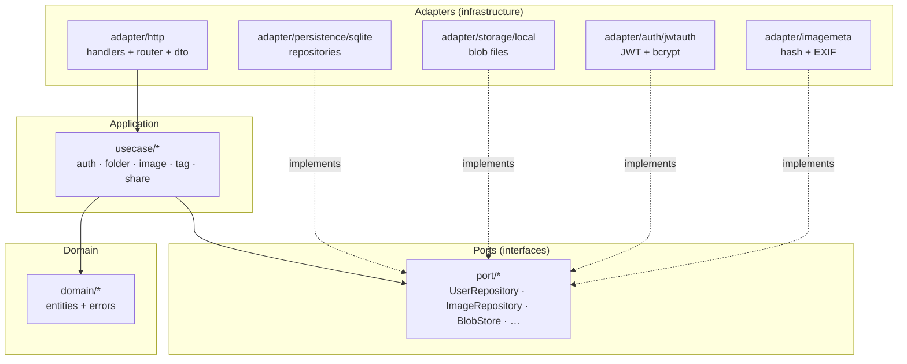
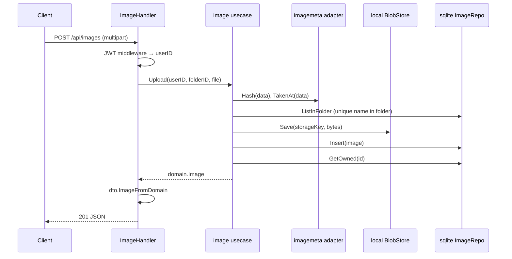
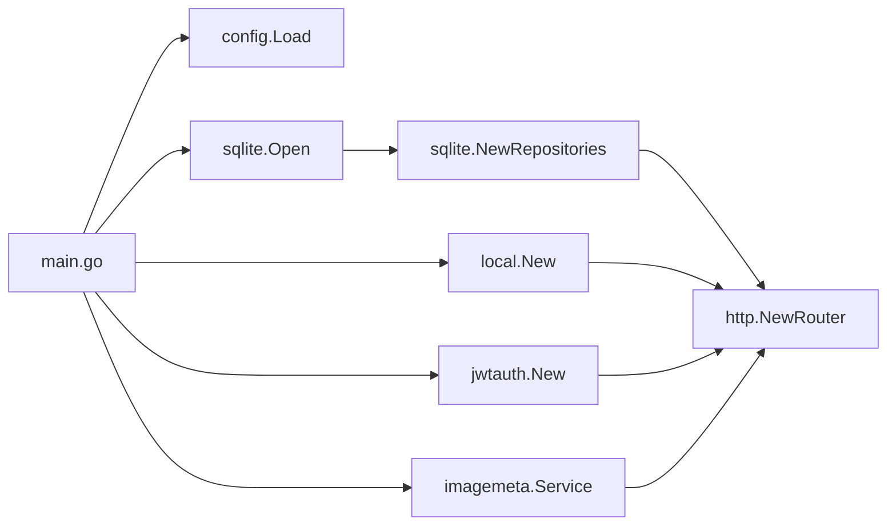
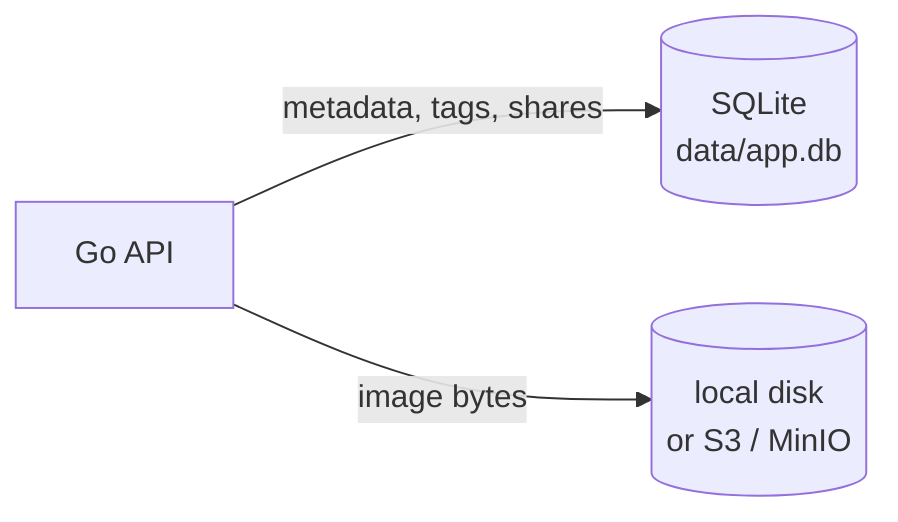

# Go API — Clean Architecture

The `apps/api` service follows **clean architecture** (ports & adapters). Business rules live in the center; HTTP, SQLite, and the filesystem are outer layers that can be swapped without changing use cases.

## Goals

- **Testable** — use cases depend on interfaces (`port`), not `*sql.DB`
- **Readable** — one bounded context per use-case package (`auth`, `folder`, `image`, …)
- **Stable API** — route surface unchanged; refactor is internal only
- **Inward dependencies** — `domain` imports nothing from this repo

---

## Layer overview



**Rule:** arrows point **inward**. `domain` never imports `adapter` or `usecase`.

---

## Request flow

Example: authenticated image upload.



Handlers only: parse HTTP → call use case → map errors to status codes → serialize DTOs.

---

## Directory layout

```
apps/api/
├── cmd/server/main.go              # composition root (wire everything)
├── docs/
│   └── architecture.md             # this file
└── internal/
    ├── domain/                     # entities + sentinel errors
    │   ├── user.go
    │   ├── folder.go
    │   ├── image.go
    │   ├── tag.go
    │   ├── share.go
    │   └── errors.go
    ├── port/                       # interfaces consumed by use cases
    │   ├── repository.go           # User/Folder/Image/Tag/Share repos
    │   ├── blobstore.go
    │   ├── auth.go                 # TokenService, PasswordHasher
    │   └── metadata.go
    ├── usecase/                    # application services (no HTTP/SQL)
    │   ├── auth/
    │   ├── folder/
    │   ├── image/
    │   ├── tag/
    │   └── share/
    ├── adapter/
    │   ├── http/                   # driving adapter
    │   │   ├── router.go
    │   │   ├── *_handler.go
    │   │   ├── errors.go
    │   │   └── dto/                # JSON request/response shapes
    │   ├── persistence/sqlite/     # driven adapter — SQL
    │   │   ├── db.go               # schema + migrations
    │   │   ├── repos.go            # NewRepositories()
    │   │   └── *_repo.go
    │   ├── storage/local/          # driven adapter — files
    │   ├── auth/jwtauth/           # JWT + bcrypt + middleware
    │   └── imagemeta/              # SHA-256 + EXIF
    ├── config/                     # env config
    ├── health/                     # liveness probe
    └── httpx/                      # JSON helpers
```

---

## Layers in detail

### Domain (`internal/domain`)

Pure Go types and rules. No JSON tags, no SQL, no `net/http`.

| Package   | Contents |
|-----------|----------|
| `user`    | `User` |
| `folder`  | `Folder`, `FolderOption`, `Breadcrumb`, `FolderStat` |
| `image`   | `Image`, `ImageFile`, `ImageListFilter`, `ImageUpdate`, `AllowedMimes` |
| `tag`     | `Tag` |
| `share`   | `Share`, `ShareView`, resource type constants |
| `errors`  | `ErrNotFound`, `ErrForbidden`, `ErrConflict`, `ErrInvalidInput`, `ErrUnauthorized`, `DuplicateImageError` |

### Ports (`internal/port`)

Interfaces that use cases need. Implementations live in `adapter/`.

| Interface | Implemented by |
|-----------|----------------|
| `UserRepository` | `sqlite.UserRepo` |
| `FolderRepository` | `sqlite.FolderRepo` |
| `ImageRepository` | `sqlite.ImageRepo` |
| `TagRepository` | `sqlite.TagRepo` |
| `ShareRepository` | `sqlite.ShareRepo` |
| `BlobStore` | `local.Store` or `s3.Store` (via `storage.NewBlobStore`) |
| `TokenService`, `PasswordHasher` | `jwtauth.Service` |
| `ImageMetadata` | `imagemeta.Service` |

### Use cases (`internal/usecase`)

Orchestrate domain logic. Accept `port` interfaces via struct fields.

| Service | Responsibilities |
|---------|------------------|
| `auth` | Register, login, me |
| `folder` | CRUD, breadcrumb, list-all with paths, stats via repo |
| `image` | List/filter, timeline groups, upload (dedup), update, soft delete, restore, permanent delete, file access |
| `tag` | List tags, replace image tags |
| `share` | Create/list/delete shares, view by token, public file, share-scoped file |

Return `domain` types or domain errors — never HTTP status codes.

### Adapters (`internal/adapter`)

| Adapter | Role |
|---------|------|
| **http** | Chi router, handlers, JWT group, `dto` mapping, `WriteError` → status |
| **sqlite** | All SQL, migrations, row scanning, tag attachment |
| **local** | Save/open/delete files under `STORAGE_PATH` |
| **jwtauth** | Issue/parse JWT, bcrypt, `UserIDFromContext` |
| **imagemeta** | Content hash for dedup; EXIF `taken_at` for timeline |

---

## Composition root

`cmd/server/main.go` is the only place that constructs concrete adapters and injects them:



To add a feature: define port → implement sqlite adapter → add use-case method → add handler + route → wire in `main.go`.

---

## HTTP surface

| Auth | Method | Path |
|------|--------|------|
| — | GET | `/api/health` |
| — | POST | `/api/auth/register`, `/api/auth/login` |
| — | GET | `/api/public/images/{id}/file` |
| — | GET | `/api/share/{token}`, `/api/share/{token}/images/{imageId}/file` |
| JWT | GET | `/api/auth/me` |
| JWT | * | `/api/folders`, `/api/folders/all`, `/api/folders/breadcrumb`, `/api/folders/{id}` |
| JWT | * | `/api/images`, `/api/images/timeline`, `/api/images/{id}`, restore, permanent delete |
| JWT | PUT | `/api/images/{id}/tags` |
| JWT | GET | `/api/tags` |
| JWT | * | `/api/shares`, `/api/shares/{id}` |

Protected routes use `jwtauth.Middleware` on a Chi sub-router.

---

## Error mapping

Use cases return `domain` errors. HTTP layer maps them in `adapter/http/errors.go`:

| Domain error | HTTP |
|--------------|------|
| `ErrNotFound` | 404 |
| `ErrForbidden` | 403 |
| `ErrConflict` | 409 |
| `ErrInvalidInput` | 400 |
| `ErrUnauthorized` | 401 |
| `DuplicateImageError` | 409 (custom body with `existing` image) |
| other | 500 |

---

## Data stores



- **SQLite** — users, folders, images (incl. soft delete, favorites, hash, `taken_at`), tags, shares
- **Blob storage** — `STORAGE_DRIVER=local` (default) or `s3` (AWS S3, MinIO, R2); keys `{userID}/{imageID}/{filename}`

See `docs/infra.md` for MinIO docker-compose and env vars.

---

## Testing strategy

| Layer | Approach |
|-------|----------|
| `domain` | Pure unit tests (no mocks) |
| `usecase` | Unit tests with fake `port` implementations |
| `adapter/persistence/sqlite` | Integration tests with temp SQLite file |
| `adapter/http` | `httptest` on router (`router_test.go`) |
| `health` | Handler test |

Run: `go test ./...` from `apps/api` (or `pnpm test` at repo root).

---

## Adding a new feature (checklist)

1. **Domain** — entity fields or new error in `internal/domain`
2. **Port** — extend or add interface method in `internal/port`
3. **SQLite** — implement in `adapter/persistence/sqlite`
4. **Usecase** — business logic in `internal/usecase/<context>`
5. **DTO** — JSON shape + `mapper.go` if needed
6. **Handler** — thin HTTP in `adapter/http`
7. **Router** — register route in `router.go`
8. **Wire** — inject in `cmd/server/main.go`

Keep handlers thin: no SQL, no business rules.

---

## Related docs

- Web UI design: `apps/web/DESIGN.md`
- Monorepo scaffold: `docs/superpowers/specs/2026-09-03-monorepo-scaffold-design.md`
