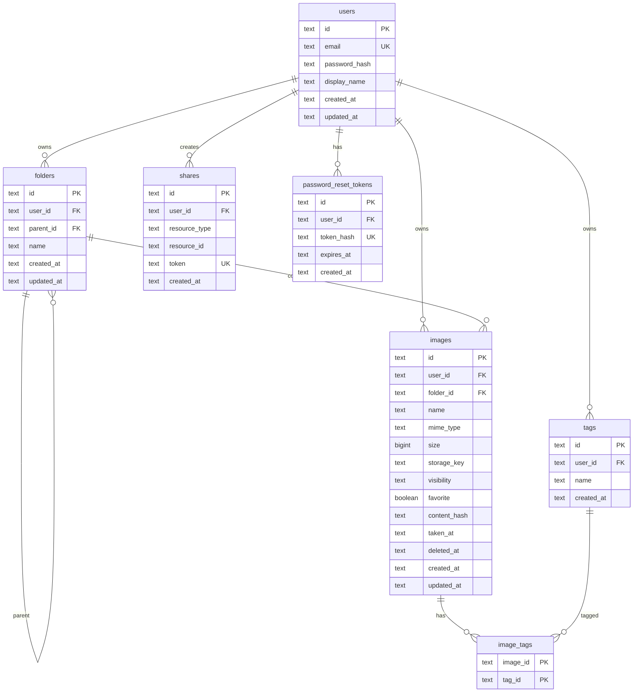

# Database ER Diagram

Entity-relationship model for the image-storage API database.

**Engines:** SQLite (default, `DATABASE_PATH`) and PostgreSQL (`DATABASE_URL`). Both adapters share the same logical schema; Postgres defines the canonical shape in one place, while SQLite applies incremental migrations at startup.

**Source:** `internal/adapter/persistence/postgres/db.go`, `internal/adapter/persistence/sqlite/db.go`

---

## ER Diagram

---

## Relationships

| From | To | Cardinality | FK column | On delete | Notes |
|------|----|-------------|-----------|-----------|-------|
| `folders` | `users` | N:1 | `user_id` | CASCADE | Every folder belongs to one user |
| `folders` | `folders` | N:1 | `parent_id` | CASCADE | Optional tree; `NULL` = root folder |
| `images` | `users` | N:1 | `user_id` | CASCADE | Image owner |
| `images` | `folders` | N:1 | `folder_id` | SET NULL | Optional; deleting folder clears reference |
| `tags` | `users` | N:1 | `user_id` | CASCADE | Tags scoped per user |
| `image_tags` | `images` | N:1 | `image_id` | CASCADE | Junction table (M:N) |
| `image_tags` | `tags` | N:1 | `tag_id` | CASCADE | Junction table (M:N) |
| `shares` | `users` | N:1 | `user_id` | CASCADE | Share creator |
| `shares` | `images` / `folders` | N:1 | `resource_id` | — | Polymorphic; enforced in application code |
| `password_reset_tokens` | `users` | N:1 | `user_id` | CASCADE | One active token per user (replaced on create) |

---

## Indexes

| Table | Index | Columns |
|-------|-------|---------|
| `users` | `idx_users_email_lower` (Postgres) / column UNIQUE (SQLite) | `LOWER(email)` / `email` |
| `folders` | `idx_folders_user_parent` | `(user_id, parent_id)` |
| `images` | `idx_images_user_folder` | `(user_id, folder_id)` |
| `images` | `idx_images_user_hash` | `(user_id, content_hash)` |
| `images` | `idx_images_deleted` | `(user_id, deleted_at)` |
| `tags` | `idx_tags_user` | `(user_id)` |
| `tags` | unique constraint | `(user_id, name)` |
| `shares` | `idx_shares_token` | `(token)` |
| `password_reset_tokens` | `idx_password_reset_user` | `(user_id)` |

---

## Notes

1. **Soft delete** — Trashed images set `images.deleted_at`; there is no separate trash table.
2. **Blob storage** — `images.storage_key` references files in local/S3/Supabase storage, not in the database.
3. **Polymorphic shares** — `shares.resource_type` is `"image"` or `"folder"`; `resource_id` has no database foreign key.
4. **Deduplication** — `(user_id, content_hash)` is indexed but not unique; duplicates are allowed at the DB level.
5. **SQLite vs Postgres** — Functionally equivalent after SQLite migrations run. Minor type differences: `images.size` is `INTEGER` (SQLite) vs `BIGINT` (Postgres); `images.favorite` is `INTEGER 0/1` (SQLite) vs `BOOLEAN` (Postgres).
