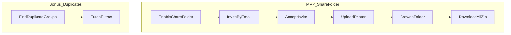

# Product Plan: Share Folder (+ Duplicate Finder bonus)

**Status:** In progress (schema + API + initial UI)  
**Last updated:** 2026-09-17  
**Repo:** image-storage monorepo (`apps/web` + `apps/api`)

---

## 1. Summary

**MVP focus:** **Share Folder** — a folder the owner opens for collaboration: invite people by email, they get login access, and everyone can upload, download, and manage photos together (including subfolders).

**Bonus feature (same release or shortly after):** **Duplicate Finder** — group exact copies by `content_hash`, review, and trash extras.

**Out of MVP:** Gallery clutter / screenshot detection.

**Pipeline:**

```
Owner enables Share Folder → Invites people → Everyone uploads & browses together → Download all (zip)
```

Personal drive continues as today. A Share Folder is **collaborative** (members with accounts). This is separate from the existing **link share** (`/share/{token}`) which is view-only and anonymous.

---

## 2. Two sharing modes (don't confuse them)

| | Link share (exists today) | Share Folder (MVP) |
|---|---|---|
| **Access** | Anyone with URL | Invited members with accounts |
| **Upload** | No | Yes |
| **Manage** | View / download only | Upload, delete own files, subfolders |
| **API** | `POST /api/shares` → `/share/{token}` | Member invites + folder ACL |
| **Use case** | Send one link quickly | Ongoing shared album (trip, team, friends, family) |

---

## 3. Confirmed decisions

| Decision | Choice | Notes |
|---|---|---|
| **MVP priority** | **Share Folder first** | Main product effort. |
| Duplicate finder | **Bonus feature** | Exact hash match; sidebar entry only. |
| Gallery clutter | **Out of MVP** | Deferred. |
| Duplicate on upload | **Allow both** | Duplicates surfaced in Duplicate Finder only. |
| Download all (zip) | **Phase 1 MVP** | For Share Folder members. |
| Inbox folder | **Not needed** | Use existing drive. |
| Collaboration model | **Invited members** | Email invite → register/login → access that folder tree. |
| Subfolders | **Yes** | Full tree under each Share Folder. |
| Member delete | **Own uploads only** | Owner can delete anything. |
| Zip download | **Sync, 500 MB cap** | Suggest subfolder if over limit. |
| Share folders per account | **Multiple allowed** | e.g. "Trip 2026", "Design assets", "Album" — each can be shared independently. |

---

## 4. Problem statement

### Share Folder (primary)

- People need a shared space for photos — trips, events, projects, friends, or family — not just a one-time link.
- One person shouldn't be the only uploader; **everyone involved should add photos**.
- View-only links (`/share/{token}`) don't let others contribute.
- Split devices and accounts (iPhone/Android, different logins) need a **simple invite → login → shared folder** flow.

### Duplicate Finder (bonus)

- Same file uploaded twice wastes storage.
- Simple exact-duplicate cleanup is useful but **not the main reason to use the app**.

---

## 5. What already exists (reuse)

| Capability | Location |
|---|---|
| Image upload, folders, trash | `apps/api/internal/usecase/image/`, `folder/` |
| SHA-256 `content_hash` | `imagemeta/service.go` |
| Link share (view-only) | `usecase/share/`, `/share/{token}` |
| Timeline, tags, favorites | Existing drive |
| Multi-select, bulk move, trash | `DriveBrowser.tsx` |

---

## 6. Features by phase

### Phase 1 — MVP (Share Folder)

#### 6.1 Share Folder (core)

- Owner toggles **Share Folder** on any folder (creates collaborative access on that folder tree).
- Owner invites people by email.
- Invitee accepts → register or login → sees **only** Share Folder(s) they belong to (not owner's private drive).
- Owner keeps other folders private.

**Member capabilities:**

- View folder tree and images
- Upload to any subfolder
- Create subfolders (default: yes in MVP)
- Download individual photos
- Download all as zip (~500 MB cap)
- Delete only their own uploads

**Owner capabilities:**

- Invite / remove members
- Delete any image in the folder
- Turn off sharing / delete folder

#### 6.2 Download all (zip)

- `GET /api/folders/{id}/download` — owner or member.
- Sync stream, 500 MB cap.

#### 6.3 Member experience

- Members default to their shared folder list.
- Owner sees Share Folder badge + "Manage access" on shared folders.
- Panel: members, pending invites, copy invite link.

---

### Phase 1 — Bonus (Duplicate Finder)

- Sidebar link **Duplicates**.
- Group by `content_hash`; suggest keeper; trash extras.
- Optional: exclude images inside Share Folders from scan.

---

### Phase 2 — Polish

| Feature | Description |
|---|---|
| PWA | Mobile upload |
| Bulk delete API | For duplicate cleanup |
| Link share password + expiry | Existing token shares |
| Email delivery for invites | MVP: copy invite URL |
| Near-duplicate detection | If requested |

---

### Phase 3 — Future

- Gallery clutter detection
- Native apps
- Comments / reactions
- Face grouping
- Billing

---

## 7. Tools reference

| Tool | Priority | What it does |
|---|---|---|
| **Share Folder** | Core | Collaborative folder; members upload & browse |
| **Invite & accept** | Core | Email invite → account → folder access |
| **Download all** | Core | Zip (500 MB cap) |
| **Link share** | Existing | View-only token link (unchanged) |
| **Duplicate Finder** | Bonus | Exact duplicate groups |
| **Trash** | Existing | Soft delete |

---

## 8. User flows

### 8.1 Owner — enable sharing

```
1. Create or select folder → "Share with others"
2. Invite by email (or copy invite link for MVP)
3. Invitee accepts → logs in
4. Everyone uploads, browses, downloads / zips
```

### 8.2 Member daily use

```
1. Log in → see shared folder(s)
2. Open folder → upload to subfolder
3. Download photos or zip album
```

### 8.3 Duplicate cleanup (bonus)

```
1. Open "Duplicates" in sidebar
2. Review groups → trash extras → empty trash
```

### Flow diagram



---

## 9. API additions

### Share Folder (MVP)

| Method | Path | Description |
|---|---|---|
| POST | `/api/folders/{id}/sharing` | Enable collaborative sharing on folder |
| DELETE | `/api/folders/{id}/sharing` | Disable sharing (owner) |
| GET | `/api/folders/{id}/members` | List members |
| POST | `/api/folders/{id}/members` | Invite by email |
| DELETE | `/api/folders/{id}/members/{userId}` | Remove member |
| POST | `/api/share-folder/invites/{token}/accept` | Accept invite |
| GET | `/api/share-folder/folders` | Folders current user can access as member |
| GET | `/api/folders/{id}/download` | Zip (owner or member) |

**Existing link share unchanged:** `POST /api/shares`, `GET /api/share/{token}`.

**Access control:** List/upload/delete on folder tree respects owner or `folder_members`.

### Duplicate finder (bonus)

| Method | Path | Description |
|---|---|---|
| GET | `/api/storage/duplicates/summary` | Count + reclaimable bytes |
| GET | `/api/storage/duplicates` | Paginated groups |
| POST | `/api/storage/trash-duplicates` | Soft-delete suggested/selected |

---

## 10. Data model additions

### 10.1 Folders — sharing flag

```sql
ALTER TABLE folders ADD COLUMN is_share_folder BOOLEAN NOT NULL DEFAULT false;
```

When true, folder supports member invites and collaborative ACL.

Multiple folders per owner can have `is_share_folder = true`.

### 10.2 Folder members

```sql
CREATE TABLE folder_members (
  id TEXT PRIMARY KEY,
  folder_id TEXT NOT NULL REFERENCES folders(id) ON DELETE CASCADE,
  user_id TEXT NOT NULL REFERENCES users(id) ON DELETE CASCADE,
  role TEXT NOT NULL DEFAULT 'member',
  invited_by TEXT REFERENCES users(id),
  joined_at TEXT NOT NULL,
  UNIQUE(folder_id, user_id)
);
```

### 10.3 Pending invites

```sql
CREATE TABLE folder_invites (
  id TEXT PRIMARY KEY,
  folder_id TEXT NOT NULL REFERENCES folders(id) ON DELETE CASCADE,
  email TEXT NOT NULL,
  token TEXT NOT NULL UNIQUE,
  invited_by TEXT NOT NULL REFERENCES users(id),
  expires_at TEXT NOT NULL,
  accepted_at TEXT,
  created_at TEXT NOT NULL
);
```

### 10.4 Images — uploader tracking

```sql
ALTER TABLE images ADD COLUMN uploaded_by TEXT REFERENCES users(id);
```

Default `uploaded_by = user_id` (folder owner). Member uploads set `uploaded_by` to member id.

---

## 11. Backend architecture

```
apps/api/internal/usecase/
  sharefolder/      # invites, members, ACL, member-scoped listing
  storage/          # duplicates (bonus)
```

| Resource | Access |
|---|---|
| Owner private folders | Owner only |
| Share folder tree | Owner + members |
| Delete in share folder | Owner: any; member: own uploads only |
| Link share token | Unchanged public/private rules |

Handlers: `sharefolder_handler.go`, extend `folder_handler.go`, `image` ACL, `storage_handler.go` (bonus).

---

## 12. Frontend architecture

### Routes

| Route | Purpose |
|---|---|
| `/dashboard` | Owner drive; Share Folder badge on shared folders |
| `/dashboard/shared` | Member: list of shared folders |
| `/invite/share-folder/{token}` | Accept invite |
| `/dashboard/duplicates` | Bonus |

### Components

- `ShareFolderSettings.tsx` — enable sharing, invites, members
- `ShareFolderInviteAccept.tsx`
- Member-scoped branch in `DriveBrowser.tsx`
- `DuplicateReview.tsx` (bonus)

---

## 13. Duplicate keeper rules (bonus)

1. Favorite wins  
2. Else in folder beats root  
3. Else newest `createdAt`  
4. User override before trash  

---

## 14. Success metrics

### Share Folder

| Metric | Target |
|---|---|
| Sharing enabled | ≥1 folder shared within first session |
| Invite accepted | ≥1 member within 7 days |
| Member upload | ≥1 non-owner upload within 14 days |
| Download all | Used within 30 days |

### Duplicate Finder

| Metric | Target |
|---|---|
| Opened | 20% of users within 30 days |
| Action | 10% trash ≥1 group |

---

## 15. Implementation order

1. This document approved  
2. Schema: `is_share_folder`, `folder_members`, `folder_invites`, `uploaded_by`  
3. Backend: `sharefolder` use case + ACL  
4. Backend: invite accept + zip download  
5. Frontend: Share Folder settings + member view  
6. QA: owner + member on mobile  
7. Bonus: duplicate finder  
8. Update README + architecture docs  

---

## 16. Resolved design rules

| Rule | Decision |
|---|---|
| Naming | **Share Folder** (collaborative), not "Family folder" |
| vs link share | Token link = view-only; Share Folder = members + upload |
| Multiple share folders | Allowed per account |
| Subfolders | Full tree under each Share Folder |
| Member delete | Own uploads only |
| Zip | Sync, 500 MB cap |
| Member visibility | Shared folders only — not owner's private drive |
| Invite MVP | Copy link OK; email delivery Phase 2 |

---

## 17. Related docs

- [API architecture](../apps/api/docs/architecture.md)
- [ER diagram](../apps/api/docs/er-diagram.md)
- [Root README](../README.md)

---

## 18. Changelog

| Date | Change |
|---|---|
| 2026-03-16 | Initial plan (family + cleaner). |
| 2026-03-16 | MVP = family folder; duplicate bonus; clutter removed. |
| 2026-03-16 | **Renamed to Share Folder** — generic collaborative folder; multiple per account; distinct from link share. |
| 2026-09-17 | Batch 1: DB schema, sharefolder API, member browse + invite accept UI (branch `feat/share-folder`). |
| 2026-09-17 | Batch 2–3: owner settings, member upload/ACL, folder zip download (500 MB cap). |
